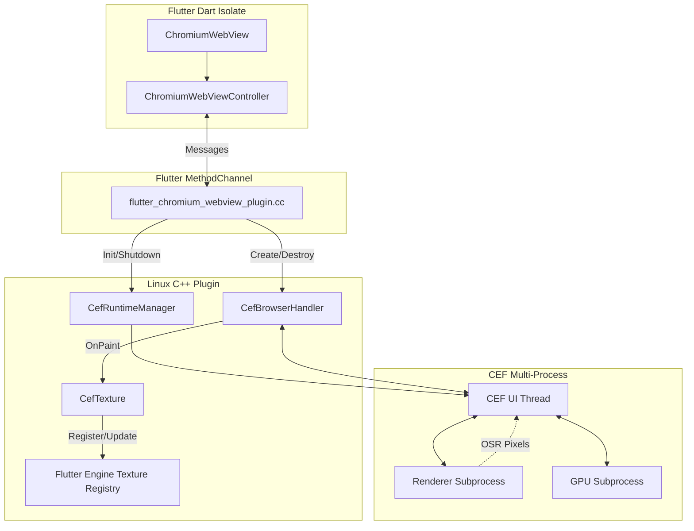

# Flutter Chromium WebView Architecture

This document describes the internal architecture of the `flutter_chromium_webview` plugin. It outlines how the Dart API communicates with the native C++ plugin, and how the Chromium Embedded Framework (CEF) renders HTML frames into Flutter textures.

## Architecture Diagram

## Components

### Dart Public API
The `ChromiumWebViewController` manages the lifecycle of a single browser instance. It is responsible for initiating creation, sending navigation requests, and processing events (like URL or title changes). The `ChromiumWebView` widget is responsible for coordinating pointer events, keyboard focus, and size constraints.

### Flutter MethodChannel Communication
Communication between the Dart isolate and the native C++ plugin occurs asynchronously over a Flutter `MethodChannel`. Keyboard events, mouse events, layout changes, and lifecycle commands are dispatched from Dart to C++, while loading state and page events flow from C++ to Dart.

### Native C++ Plugin
The core of the native implementation resides in `flutter_chromium_webview_plugin.cc`. This file handles the MethodChannel messages on the Flutter platform thread. It delegates CEF initialization to the `CefRuntimeManager` and instantiates `CefBrowserHandler` instances for each WebView.

### CEF Runtime Manager
The `CefRuntimeManager` ensures that CEF is initialized exactly once per application lifecycle. Since CEF operates globally per process, the manager handles the global `CefInitialize` and `CefShutdown` calls. It also coordinates the GTK message pump, allowing CEF to process events on the application's main thread.

### CEF Browser Handler
For each webview, a `CefBrowserHandler` (which implements `CefClient`, `CefRenderHandler`, and other CEF handler interfaces) is created. It intercepts events from the CEF browser process, such as navigation state changes and paint events, and forwards them to the Flutter plugin or texture.

### Browser Subprocesses
CEF uses a multi-process architecture. The main application process runs the CEF UI thread, while separate subprocesses handle rendering, networking, and GPU operations. Separate processes do not establish a security guarantee; renderer-crash recovery and sandbox confinement still require validation.

### Frame Buffering and Flutter Texture Registration
CEF is configured for Off-Screen Rendering (OSR). Instead of drawing to a native window, the renderer provides pixel buffers to the `CefBrowserHandler` via the `OnPaint` callback. 

These pixels are stored in a `CefTexture` instance, which acts as a bridge between CEF and Flutter's texture registry. The texture instance copies the incoming pixels into a retained frame buffer. 

**Frame-buffer ownership:** The implementation retains a snapshot of the raster thread's pixel buffer. When Flutter's engine requests the texture (which happens on the Flutter raster thread), it is provided a stable copy of the pixels. This prevents the CEF producer (running on the UI thread) from invalidating the memory while Flutter is drawing it, avoiding race conditions and invalid memory access.

### Thread Dispatching
* **Flutter Platform Thread:** Handles MethodChannel messages, GTK events, and plugin lifecycle.
* **CEF UI Thread:** In this implementation, the CEF UI thread shares the Flutter Platform thread via the GTK message pump. This shared thread simplifies synchronization but requires that long-running operations are not executed directly on the thread.
* **Flutter Raster Thread:** Calls the texture's copy callback to upload pixels to the GPU.

### Browser Creation and Disposal
Browser creation is idempotent. The Dart controller requests creation, and the C++ plugin assigns an internal **Browser ID**. Simultaneously, it registers a `CefTexture` and receives a **Texture ID** from Flutter. 

Browser IDs and Texture IDs are managed independently. The Texture ID is returned to Dart immediately upon creation, allowing the widget to mount the `Texture` widget. When disposed, the plugin requests browser closure and waits for CEF's asynchronous acknowledgement before unregistering the texture and destroying the handler.

### Dialogs, Context Menus and Popups
Unlike conventional desktop apps, CEF off-screen rendering delegates UI presentation to the host application.
* **JavaScript Dialogs**: `CefJSDialogHandler` intercepts `alert()`, `confirm()`, and `prompt()`. These trigger a Dart `onJSDialog` future, pausing CEF script execution until the user responds via the Flutter UI.
* **Context Menus**: `CefContextMenuHandler` intercepts right-clicks, serializing the native `CefMenuModel` into a JSON-compatible map. Dart renders the menu natively via `showMenu` and forwards the selected command ID back to CEF to execute the native action (like Copy, Paste, or Back).
* **HTML Select Dropdowns**: CEF treats `<select>` elements as separate `PET_POPUP` paint events. The `CefBrowserHandler` provisions a secondary `popup_texture_` and routes its texture ID to Dart, which composites it over the main browser view using a Flutter `Stack`.
* **New Windows**: Links opening in a new tab/window are intercepted via `OnBeforePopup` and passed to Dart's `onNewWindowRequested` to manually spawn a new `ChromiumWebView` instance, bypassing CEF's default unmanaged native window creation.
