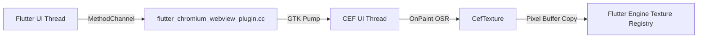

# Linux CEF Backend — Setup and Architecture

The Linux backend for `flutter_chromium_webview` uses the Chromium Embedded Framework (CEF) through Off-Screen Rendering (OSR) and Flutter textures.

## Requirements and System Libraries

### Operating System & Architecture
- **OS**: Linux desktop distributions (Ubuntu 20.04+, Debian 11+, Fedora 36+, Arch Linux, etc.)
- **Architecture**: `x64` (AMD64)
- **Display Server**: X11 display (or Wayland via XWayland). The plugin explicitly configures CEF for the X11 windowing backend.

### Development & Build Tools
Building a Flutter app with CEF on Linux requires:
- **Clang / LLVM** C++ compiler (supporting C++17)
- **CMake** 3.19 or newer
- **Ninja** (`ninja-build`)
- **pkg-config**
- **GTK 3** development libraries (`libgtk-3-dev`)
- **PulseAudio** or **ALSA** for audio playback (`libpulse-dev` / `pulseaudio`)

On Ubuntu / Debian systems:
```bash
sudo apt-get update
sudo apt-get install -y clang cmake ninja-build pkg-config libgtk-3-dev pulseaudio pulseaudio-utils
```

### Unprivileged User Namespaces and Sandbox Configuration
Chromium keeps sandboxing enabled by default; the plugin does not fall back to `--no-sandbox`.

- **Production / packaged applications (recommended):** Ship an application-specific AppArmor profile permitting `userns` for your executable (for example under `/etc/apparmor.d/<your-app>` granting `userns,`) or use distro-native packaging confinement (Flatpak/Snap/deb AppArmor profile) rather than relaxing system-wide kernel settings.
- **Local development / CI on Ubuntu 24.04+ / 26.04:** If running unpackaged binaries on a host where AppArmor restricts unprivileged user namespaces (`kernel.apparmor_restrict_unprivileged_userns = 1`), you can temporarily permit user namespaces for local testing with:
```bash
sudo sysctl -w kernel.apparmor_restrict_unprivileged_userns=0
```

## CEF Distribution and Automatic Download

CEF is a large binary (~100 MB compressed, ~1 GB uncompressed). The plugin does not bundle CEF inside the pub.dev package archive.

Instead, during your **first build**, CMake automatically:
1. Downloads the pinned, SHA-256 verified CEF `minimal` distribution:
   - Version: `149.0.4+g2f1bfd8+chromium-149.0.7827.156`
   - Archive: `cef_binary_149.0.4+g2f1bfd8+chromium-149.0.7827.156_linux64_minimal.tar.bz2`
2. Extracts it to the build cache directory.
3. Compiles `libcef_dll_wrapper` using Ninja.

### Offline Builds
To build without an internet connection, pre-download the tarball and pass the path to CMake via the `CEF_TARBALL` variable:
```bash
flutter build linux --dart-define=CEF_TARBALL=/path/to/cef_binary_..._linux64_minimal.tar.bz2
```

## Architecture and Rendering Pipeline


```mermaid
graph LR
    Flutter[Flutter UI Thread] -->|MethodChannel| Plugin[flutter_chromium_webview_plugin.cc]
    Plugin -->|GTK Pump| CEF[CEF UI Thread]
    CEF -->|OnPaint OSR| Texture[CefTexture]
    Texture -->|Pixel Buffer Copy| Engine[Flutter Engine Texture Registry]
```

1. **Off-Screen Rendering (OSR)**: CEF renders pages into memory buffers without creating top-level native X11 windows.
2. **Pixel Buffer Flow & Ownership**: Frames delivered via `CefRenderHandler::OnPaint` convert BGRA→RGBA into an exact-sized staging buffer in `FlutterChromiumTexture`. On Flutter's raster thread (`copy_pixels`), the staging buffer is swapped into the raster-owned front buffer in $O(1)$ without a second copy, and the previous staging buffer is immediately released so idle WebViews retain only a single exact-sized frame buffer. Closing a popup (`OnPopupShow(false)`) or disposing a browser marks buffers for raster-safe release (`flutter_chromium_texture_clear`), calls `WasHidden(true)`, and invokes `malloc_trim(0)` on `OnBeforeClose` to return freed heap pages to the OS.
3. **Flutter Texture**: The texture is registered with the Flutter Engine's texture registry (`flutter::TextureRegistrar`), making the webview an ordinary Flutter widget that can be positioned, clipped, transformed, and layered.
4. **Message Loop & GTK Lifecycle Integration**:
   - CEF runs `CefRunMessageLoop()` (`settings.external_message_pump = false`) on the main thread, entered once from a `g_idle_add` callback after `CefInitialize()`. Chromium's `MessagePumpGlib` iterates the default GLib `GMainContext`, so GTK and Flutter sources are dispatched by the same loop and block cleanly when idle (`< 1%` main-thread CPU).
   - **Why external message pump is not used on Linux:** In CEF 149 on Linux, `MessagePumpExternal` inherits from `base::MessagePumpGlib`, whose `GSource::prepare()` returns a `0 ms` timeout whenever the pump is outside `Run()`. That causes any outer GTK `GMainLoop` on the default `GMainContext` to busy-spin one core at ~100% CPU even when `OnScheduleMessagePumpWork` is implemented.
   - **One-shot loop constraint in CEF 149:** Calling `CefRunMessageLoop()` a second time after `CefQuitMessageLoop()` triggers a fatal `CHECK` (`SIGTRAP`) in `KeepAliveRegistry::Register()`. Therefore the loop is never restarted; instead, `CefRuntimeManager` tracks `GApplication` hold/release/quit transitions (`g_application_hold`, `g_application_release`, `g_application_quit`) so `CefRunMessageLoop()` stays active while the application is held alive (including across multi-window or `g_application_hold()` last-window-remove → window-reopen flows) and calls `CefQuitMessageLoop()` once when the final hold/window is released or `g_application_quit()` is invoked.
   - **Clean shutdown order:** On `GApplication::shutdown`, all plugins close their browsers (`CloseAll`), `CefRuntimeManager::Shutdown()` drains `CloseBrowser` acknowledgements and ready GLib/CEF callbacks, marks `GApplication` as quit so `g_application_run()` does not iterate `GMainContext` after `CefShutdown()` destroys Chromium's `AtExitManager`, and then executes `CefShutdown()`.
5. **Memory Profile Opt-out**: By default on Linux, `SoftwareRenderingApp` disables speculative spare renderer creation (`SpareRendererForSitePerProcess`) and unused desktop Chrome background features (`OptimizationHints`, `MediaRouter`, `Translate`, `BackForwardCache`, component updater, extensions, sync) while keeping sandboxing, site isolation, TLS validation, and multi-process architecture fully enabled. Set `FLUTTER_CHROMIUM_WEBVIEW_LOW_MEMORY=0` in the environment to revert to stock Chromium feature defaults.

## Input and Keyboard Handling

- **Mouse / Pointer Events**: Flutter pointer events (`PointerDownEvent`, `PointerMoveEvent`, `PointerUpEvent`, `PointerScrollEvent`) are transformed according to device pixel ratio and forwarded as CEF mouse events.
- **Keyboard & Focus**: Focus is managed between Flutter and CEF. When the widget has focus, key events are forwarded via X11 keycodes.
- **Context Menus & Dialogs**: CEF delegates JavaScript dialogs (`alert`, `confirm`, `prompt`) and context menus to Flutter widgets via `onJSDialog` and `onContextMenu`.

## Validation and Benchmarking

To run the complete Linux validation suite (analysis, unit tests, all 7 integration suites, release build, and idle-CPU/shutdown gate):
```bash
bash scripts/validate_linux.sh
```

Additional Linux verification and benchmark scripts:
- `bash scripts/check_linux_idle_cpu.sh` — verifies idle main-thread CPU, clean window close, `[CEF] Shutdown complete`, zero unhandled Dart exceptions, and zero orphan subprocesses.
- `bash scripts/test_linux_lifecycle.sh` — executes the 14-scenario GTK/WebView lifecycle matrix (multi-WebView, multi-window, held-application window reopen, rapid open/close, `exitApplication()`, `SystemNavigator.pop()`, direct `g_application_quit()`, and 10 consecutive launch/shutdown cycles).
- `bash scripts/benchmark_linux_cpu.sh` — measures per-thread and per-subprocess CPU across idle init, static page idle, active navigation, and post-close idle (JSON/CSV output).
- `bash scripts/benchmark_linux_memory.sh` — measures process-tree RSS, PSS, USS, shared, anonymous, and peak `VmHWM` across 12 scenarios including a configurable idle soak (JSON/CSV output).

See `docs/linux-0.5.6-benchmarks.md` for measured `0.5.6` CPU and RAM benchmark results.

Under WSLg (Windows Subsystem for Linux with GUI):
```bash
bash scripts/run_wsl.sh
```

## Known Limitations

- **Software Compositing**: Linux uses software pixel buffer copying between CEF (`--disable-gpu`, `--disable-gpu-compositing`) and the Flutter Engine.
- **Display Backend (`GDK_BACKEND=x11`)**: CEF is configured with `--ozone-platform=x11`. On Wayland desktops (especially virtualized graphics such as VirtualBox VMSVGA, where native Wayland subsurface initialization can time out), launch with `GDK_BACKEND=x11` to use XWayland.
- **Dynamic Linker Load Order for Custom Runners**: Tracking `g_application_hold`, `g_application_release`, and `g_application_quit` relies on `libflutter_chromium_webview_plugin.so` appearing before `libgio-2.0.so.0` in the process symbol lookup order (guaranteed by Flutter's default Linux CMake linkage). If a custom host loads the plugin via `dlopen(RTLD_LOCAL)` after GIO, hold tracking falls back to `GtkApplication::window-removed` (last-window removal), in which case custom runners must detach/destroy windows before calling `g_application_quit()` and should not remove the last window while keeping the process alive.
- **Codecs**: Standard CEF builds include open-source codecs (VP8, VP9, AV1, Opus, Vorbis). Proprietary codecs (H.264, AAC) are not licensed or included.
- **Process Lifetime**: Once `CefShutdown()` is called, CEF cannot be re-initialized in the same process; restarting the app is required.
